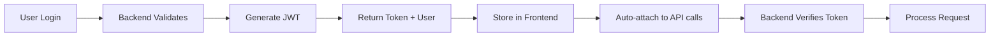
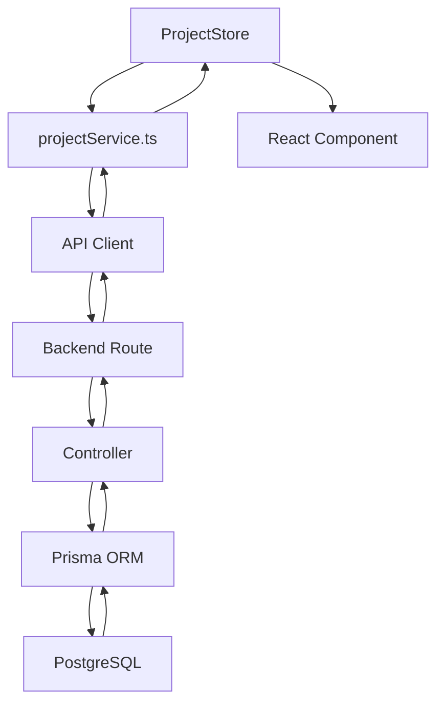
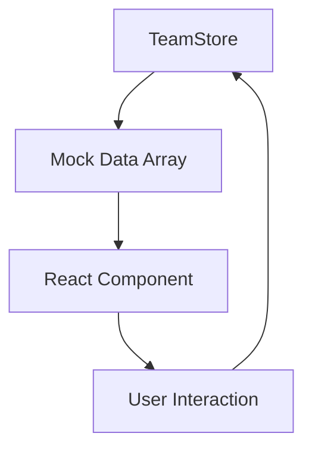

# Daritana System Architecture Review
*Generated: August 2025*

## Executive Summary

The Daritana Architect Management System is a sophisticated React + TypeScript application with Node.js/Express backend featuring multi-tenant architecture. Current status: **80% frontend complete, 40% backend integrated**.

## Table of Contents
1. [System Overview](#system-overview)
2. [Page Routes & Status](#page-routes--status)
3. [Backend API Connections](#backend-api-connections)
4. [Permissions Architecture](#permissions-architecture)
5. [Data Flow](#data-flow)
6. [Authentication System](#authentication-system)
7. [Integration Status](#integration-status)
8. [Critical Gaps & Recommendations](#critical-gaps--recommendations)

---

## System Overview

### Technology Stack
- **Frontend**: React 18, TypeScript, Vite, Zustand, Tailwind CSS
- **Backend**: Node.js, Express, Prisma ORM, PostgreSQL
- **Real-time**: Socket.io for WebSocket connections
- **Authentication**: JWT with refresh tokens
- **Architecture**: Multi-tenant SaaS with organization-based isolation

### Development Status
- **Frontend UI/UX**: 95% complete
- **Backend APIs**: 40% implemented
- **Database Schema**: 100% designed (40+ models)
- **Real-time Features**: Infrastructure ready, limited implementation
- **Production Readiness**: 30%

---

## Page Routes & Status

### Core Application Pages (16 routes)

| Page | Route | Frontend Status | Backend API | Data Source |
|------|-------|-----------------|-------------|-------------|
| Dashboard | `/dashboard` | ✅ Complete | 🔄 Partial | Mixed (API + Mock) |
| Projects | `/projects` | ✅ Complete | ✅ Connected | Backend API |
| Project Detail | `/projects/:id` | ✅ Complete | ✅ Connected | Backend API |
| Kanban Board | `/kanban`, `/tasks` | ✅ Complete | ❌ Not Connected | Mock Data |
| Timeline | `/timeline`, `/calendar` | ✅ Complete | ❌ Not Connected | Mock Data |
| Design Brief | `/design-brief` | ✅ Complete | ❌ Not Connected | Mock Data |
| Files | `/files` | ✅ Complete | 🔄 Partial | Mixed |
| Documents | `/documents` | ✅ Complete | ❌ Not Connected | Mock Data |
| Team | `/team` | ✅ Complete | ❌ Not Connected | Mock Data |
| Financial | `/financial` | ✅ Complete | 🔄 Partial | Mixed |
| Compliance | `/compliance` | ✅ Complete | ❌ Not Connected | Mock Data |
| Security | `/security` | ✅ Complete | ❌ Not Connected | Mock Data |
| Community | `/community` | ✅ Complete | ❌ Not Connected | Mock Data |
| Marketplace | `/marketplace` | ✅ Complete | ❌ Not Connected | Mock Data |
| Settings | `/settings` | ✅ Complete | ❌ Not Connected | Mock Data |
| Profile | `/profile` | ✅ Complete | ❌ Not Connected | Mock Data |

### Enterprise Features (7 routes)

| Page | Route | Frontend Status | Backend API | Data Source |
|------|-------|-----------------|-------------|-------------|
| Enterprise PM | `/enterprise-pm` | ✅ Complete | ❌ Not Connected | Mock Data |
| HR Dashboard | `/hr` | ✅ Complete | ❌ Not Connected | Mock Data |
| Learning Platform | `/learning` | ✅ Complete | ❌ Not Connected | Mock Data |
| Construction Monitor | `/construction/*` | ✅ Complete | ❌ Not Connected | Mock Data |
| Analytics | `/analytics` | ✅ Complete | ❌ Not Connected | Mock Data |
| Integrations | `/integrations` | ✅ Complete | ❌ Not Connected | Mock Data |
| Performance | `/performance` | ✅ Complete | ❌ Not Connected | Mock Data |

### Administrative Pages (5 routes)

| Page | Route | Frontend Status | Backend API | Data Source |
|------|-------|-----------------|-------------|-------------|
| Admin Portal | `/admin/*` | ✅ Complete | ❌ Not Connected | Mock Data |
| Admin Permissions | `/admin-permissions` | ✅ Complete | ❌ Not Connected | localStorage |
| Onboarding Wizard | `/onboarding` | ✅ Complete | ❌ Not Connected | Mock Data |
| ARIA Command Center | `/aria` | ✅ Complete | ❌ Not Connected | Local AI |
| Billing | `/billing` | ✅ Complete | ❌ Not Connected | Mock Data |

---

## Backend API Connections

### API Service Architecture

```
Frontend Services (src/services/)
    ↓
API Client (src/lib/api.ts)
    ↓
Express Routes (backend/src/routes/)
    ↓
Controllers (backend/src/controllers/)
    ↓
Prisma ORM (backend/prisma/)
    ↓
PostgreSQL Database
```

### Connected APIs (✅ Working)

#### 1. Authentication Service
- **Frontend**: `src/services/authService.ts`
- **Backend**: `backend/src/routes/auth.routes.ts`
- **Endpoints**:
  - POST `/auth/login`
  - POST `/auth/register`
  - POST `/auth/logout`
  - POST `/auth/refresh`
  - GET `/auth/me`

#### 2. Projects Service
- **Frontend**: `src/services/project.service.ts`
- **Backend**: `backend/src/routes/project.routes.ts`
- **Endpoints**:
  - GET `/projects` (with pagination)
  - GET `/projects/:id`
  - POST `/projects`
  - PUT `/projects/:id`
  - DELETE `/projects/:id`
  - GET `/projects/:id/team`
  - GET `/projects/:id/statistics`

#### 3. Financial Service
- **Frontend**: `src/services/financialAPI.ts`
- **Backend**: `backend/src/routes/financial.routes.ts`
- **Endpoints**:
  - GET/POST/PUT/DELETE `/financial/invoices`
  - GET/POST/PUT/DELETE `/financial/expenses`
  - GET `/financial/analytics`
  - GET `/financial/kpis`

### Partially Connected APIs (🔄 In Progress)

#### 1. Tasks Service
- **Structure exists** but UI uses mock data
- **Backend routes** defined but not integrated

#### 2. Files Service
- **Upload/download** works
- **Cloud storage** not integrated
- **Version control** incomplete

#### 3. Dashboard Service
- **Statistics** endpoint works
- **Widget data** uses mock
- **Real-time updates** not connected

### Unconnected Services (❌ Mock Only)

- Team Management API
- Compliance System API
- Marketplace API
- Community Platform API
- HR Module API
- Learning Platform API
- Enterprise PM API
- Admin Functions API
- Settings API
- Notification System (WebSocket ready but unused)

---

## Permissions Architecture

### Frontend Permission System

#### Permission Store Structure
```typescript
// src/store/permissionsStore.ts
interface UserGroup {
  id: string           // 'admin', 'project_lead', 'designer', etc.
  name: string         // Display name
  permissions: Permission[]     // Resource-based permissions
  pagePermissions: PagePermission[]  // Page-level access
}

interface PagePermission {
  pageId: string       // 'dashboard', 'projects', etc.
  visible: boolean     // Can see in navigation
  tabs?: TabPermission[]  // Tab-level permissions
  features?: { [key: string]: boolean }  // Feature flags
}
```

#### Default User Groups

| Group | Role | Access Level | Key Permissions |
|-------|------|--------------|-----------------|
| `admin` | System Administrator | Full Access | All pages, all features |
| `project_lead` | Senior Architect | Project Management | Projects, team, financial, compliance |
| `designer` | Creative Lead | Design Focus | Projects, design tools, portfolio |
| `client` | Client | View Only | Project view, approvals, documents |
| `contractor` | Contractor | Task Focus | Assigned tasks, quotations, invoices |
| `staff` | General Staff | Basic Access | Projects, tasks, documents |

#### Permission Checking Flow

1. **Route Protection** (`ProtectedRoute.tsx`)
```typescript
// Page-level check
if (!canAccessPage(userGroupId, pageId)) {
  return <AccessDenied />
}

// Feature-level check
if (!hasPermission(userGroupId, resource, action)) {
  hideFeature()
}
```

2. **Navigation Filtering** (`useFilteredNavigation.tsx`)
```typescript
// Automatically filters sidebar based on permissions
navigation.filter(item => canAccessPage(pageId))
```

3. **Tab/Feature Control**
```typescript
// Controls tab visibility within pages
if (!canAccessTab(userGroupId, pageId, tabId)) {
  hideTab()
}
```

### Backend Permission System

#### Multi-Tenant Structure
```typescript
// Organization-based isolation
User → OrganizationMember → Organization
         ↓
      Role (permissions)
         ↓
    Resource Access
```

#### Current Implementation Gaps
- ❌ **API Endpoint Protection**: Routes not checking permissions
- ❌ **Database Permission Storage**: Using localStorage instead
- ❌ **Real-time Updates**: Permission changes require refresh
- ❌ **Audit Logging**: No permission change tracking

---

## Data Flow

### 1. Authentication Flow


### 2. Data Request Flow

#### Connected Pages (Projects Example)


#### Mock Data Pages (Team Example)


### 3. Real-time Updates (WebSocket)

**Current Infrastructure** (Ready but unused):
```typescript
// Frontend
wsService.connect(userId, token)
wsService.on('update', handleUpdate)

// Backend
io.on('connection', socket => {
  socket.on('join:project', projectId => {
    socket.join(`project:${projectId}`)
  })
})
```

---

## Authentication System

### Current Implementation

#### Frontend Authentication (`authStore.ts`)
```typescript
// Development mode (current)
const devMockUser = {
  id: '1',
  name: 'Admin User',
  role: 'admin',
  permissions: getPermissionsForRole('admin')
}

// Production mode (ready)
login(email, password) → Backend → JWT → Store → Authenticated
```

#### Backend Authentication
- **JWT Strategy**: Access (15min) + Refresh (7days) tokens
- **Organization Context**: Multi-tenant isolation
- **Session Management**: Database session tracking
- **Security Features**:
  - Password hashing (bcrypt)
  - Rate limiting
  - CORS protection
  - Helmet.js security headers

### Authentication Features Status

| Feature | Frontend | Backend | Status |
|---------|----------|---------|--------|
| Login/Logout | ✅ Ready | ✅ Implemented | Working |
| Registration | ✅ Ready | ✅ Implemented | Working |
| Token Refresh | ✅ Ready | ✅ Implemented | Working |
| Password Reset | ✅ Ready | 🔄 Partial | Email service needed |
| Email Verification | ✅ Ready | 🔄 Partial | Email service needed |
| MFA/2FA | ✅ UI Ready | ❌ Not implemented | Pending |
| SSO | ❌ Not ready | ❌ Not implemented | Not planned |
| Session Management | ❌ No UI | ✅ Backend ready | Needs frontend |

---

## Integration Status

### Summary by Category

#### ✅ Fully Integrated (20%)
- Authentication system
- Project management
- Basic financial operations
- File upload/download
- Dashboard statistics

#### 🔄 Partially Integrated (15%)
- Task management (structure exists)
- User management (basic CRUD)
- Notifications (WebSocket ready)
- Documents (core features)

#### ❌ Not Integrated (65%)
- Team collaboration
- Compliance system
- Marketplace platform
- Community features
- HR management
- Learning platform
- Enterprise PM tools
- Admin functions
- Settings management

### Backend Routes Available vs Used

| Category | Available Routes | Used by Frontend | Usage % |
|----------|-----------------|------------------|---------|
| Auth | 8 | 5 | 62% |
| Projects | 12 | 8 | 67% |
| Tasks | 8 | 0 | 0% |
| Financial | 10 | 4 | 40% |
| Team | 6 | 0 | 0% |
| Files | 5 | 2 | 40% |
| Settings | 4 | 0 | 0% |
| Admin | 10 | 0 | 0% |
| **Total** | **63** | **19** | **30%** |

---

## Critical Gaps & Recommendations

### High Priority Issues (MVP Blockers)

1. **Development Authentication Override**
   - **Issue**: Auto-login bypasses real authentication
   - **Impact**: Can't test real auth flow
   - **Fix**: Remove `devMockUser` from `authStore.ts`

2. **Task Management Disconnected**
   - **Issue**: Kanban board uses mock data
   - **Impact**: Core feature non-functional
   - **Fix**: Connect to `/tasks` API endpoints

3. **Team Management Missing**
   - **Issue**: Can't assign users to projects
   - **Impact**: Collaboration impossible
   - **Fix**: Implement team assignment APIs

4. **Settings Not Persistent**
   - **Issue**: User preferences lost on refresh
   - **Impact**: Poor user experience
   - **Fix**: Create settings API and storage

### Medium Priority (Business Critical)

1. **Permission System**
   - Move from localStorage to database
   - Implement API endpoint protection
   - Add audit logging

2. **File Storage**
   - Integrate cloud storage (S3/GCS)
   - Implement file permissions
   - Add version control

3. **Notification System**
   - Connect WebSocket events
   - Implement push notifications
   - Add email notifications

4. **Financial Module**
   - Complete invoice system
   - Add payment processing
   - Implement approval workflow

### Low Priority (Enhancements)

1. **Enterprise Features**
   - Complete PM suite integration
   - Add advanced analytics
   - Implement resource planning

2. **Community Platform**
   - Social features backend
   - Content management
   - User interactions

3. **Learning System**
   - Course management
   - Progress tracking
   - Certification system

### Technical Debt

1. **API Standardization**
   - Inconsistent error handling
   - Missing pagination on some endpoints
   - No API versioning

2. **Performance**
   - No query optimization
   - Missing indexes
   - No caching strategy

3. **Testing**
   - No backend tests
   - Limited frontend tests
   - No E2E tests

4. **Documentation**
   - Missing API documentation
   - No deployment guide
   - Limited code comments

---

## Implementation Roadmap

### Phase 1: Fix Core Features (Week 1-2)
- [ ] Remove authentication override
- [ ] Connect task management API
- [ ] Implement team assignment
- [ ] Create settings persistence

### Phase 2: Complete Integration (Week 3-4)
- [ ] Move permissions to database
- [ ] Complete file storage integration
- [ ] Connect notification system
- [ ] Finish financial module

### Phase 3: Production Preparation (Week 5-6)
- [ ] Add comprehensive error handling
- [ ] Implement caching strategy
- [ ] Create deployment pipeline
- [ ] Write documentation

### Phase 4: Advanced Features (Week 7-8)
- [ ] Enterprise PM integration
- [ ] Community platform backend
- [ ] Analytics implementation
- [ ] Performance optimization

---

## Conclusion

The Daritana system has a **robust frontend** with comprehensive UI/UX but requires significant backend integration work. The architecture is sound with proper separation of concerns, but approximately **60% of backend integration** work remains.

### Key Strengths
- Complete UI/UX implementation
- Well-structured codebase
- Comprehensive permission system
- Multi-tenant architecture ready

### Critical Needs
- Complete backend API integration
- Remove development overrides
- Implement real authentication flow
- Connect core business features

### Estimated Completion
- **MVP Ready**: 4-6 weeks (with focused development)
- **Production Ready**: 8-10 weeks (including testing and optimization)
- **Full Feature Set**: 12-16 weeks (all enterprise features)

---

*This review was generated through comprehensive codebase analysis on August 2025*